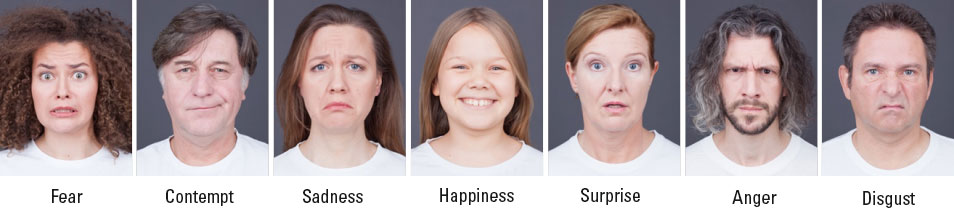

Проект сервиса для определения эмоций человека по видеосвязи (по мимике лица из видео и голосу из аудио).

# Идея сервиса

Я хотел сделать сервис распознавания эмоций людей по видеосвязи (например, для Skype, Zoom и аналогичных сервисов) или телефонных звонков.

Данный сервис может быть полезен всем кто общается со своими клиентами по видео звонкам.
Например, это может быть сотрудник технической поддержки банка дающий онлайн консультацию клиенту банка.
Или преподаватель частной онлайн школы, например, Skillbox. (Например, чтобы видеть радуются ли его студенты, или они невероятно напуганы формулами на доске и им страшно и грустно. Значит пора что то делать).

Данный сервис может помочь оценить эмоциональное состояние как клиента, что поможет в оценке его удовлетворенности обслуживанием, так и контролем работы сотрудника(например, чтобы засечь агрессивное или неподобающее поведение).

# Польза для бизнеса

Для многих видов бизнеса важны такие показатели KPI как:
* Индекс лояльности клиента — Net Promoter Score(NPS)
* Оценка удовлетворенности клиентов — Customer Satisfaction Score (CSAT)

Так же важно искать лучших специалистов по взаимодействию с клиентами.
Это позволит сформировать сильный и клиенториентированный коллектив.

# Метрика машинного обучения

Мы хотим принести дополнительную выгоду и пользу бизнесу. Я думаю оценить реальный вклад подобной системы можно по объективным показателям таким как NPS, CSAT и увеличении прибыли компании. Но для этого нужно набирать статистику и анализировать данные полученные до внедрения модели и после. Или проводить A/B тесты с группами где использовалась данная модель и где ее не было.

Сейчас можно сказать, что в задаче распознавания эмоций для бизнеса будет наиболее полезно - точное распознавание эмоций.
Я реши выбрать модель Пола Экмана, в которой выделены отдельные эмоциональные состояния:



Задача ставится мной как задача классификации эмоций:
* (Реализовано) для видео мы осуществляем детекцию человеческих лиц (я использую готовую модель из `mediapipe`) и отдаем вырезанное лицо и уменьшенное до `224х224` в нейросеть которая обучена на классификацию картинок(эмоций на crop'ах с лицами).
* (Предстоит реализовать) для аудио мы анализируем звук с помощью нейросети осуществляющей классификацию аудио.

Поэтому, я буду использовать метрики для задачи классификации.
Как показывает анализ имеющихся датасетов данные по эмоциям сильно не сбалансированы. Ниже представлено распределение по фотографиям с эмоциями из датасета `CelebV-HQ`([link](https://github.com/celebv-hq/celebv-hq)).


Наиболее частая эмоция, это нейтральное спокойное состояние.
И я думаю, что интерес для бизнеса будут представлять и более сильные, но и более редкие эмоции: например радость или агрессия.
Метрика `Accuracy` нам не подойдет, модель предсказывающая всем нейтральную эмоцию будет права в 70% случаев.
Я думаю, что в данной задаче важны как `precision`, так и `recall` поэтому я решил выбрать в качестве метрики `F1-меру`.

# Текущий dataset
В выбранной задаче анализа видео звонков по web-камере обычно лица людей представлены крупно на экране и человек смотрит на нас анфас.

Для этой задачи подошел датасет `RAVDESS`([link](https://zenodo.org/record/1188976#.ZE6NGSPP2Un)).
Я запустил модель детектор лиц из `mediapipe` и нарезал из него набор лиц актеров изображающих различные эмоции
(01 = neutral, 02 = calm, 03 = happy, 04 = sad, 05 = angry, 06 = fearful, 07 = disgust, 08 = surprised).

Ниже приведен пример полученной картинки из полученного обучающего набора данных:


Датасет сбалансированный, актеры с порядковыми номерами с 1 по 19 были в выборке `train`(~80%), с 20 по 24 в выборке `test`(~20%).

# Текущая модель (baseline)
На данных лицах была обучена модель классификатор картинок на базе `Resnet50`.
Данный `baseline` представлен в `face_emotion_classifier.ipynb`.

# Результат 
Ниже представлена полученная метрика F1 на датасете `RAVDESS`([link](https://zenodo.org/record/1188976#.ZE6NGSPP2Un)) в задаче классификации эмоций по вырезанным лицам актеров из кадров видео.

```
────────────────────────────────────────────────────────────────────────────────────────────────────────────────────────
     Validate metric           DataLoader 0
────────────────────────────────────────────────────────────────────────────────────────────────────────────────────────
         val_f1              0.978730320930481
        val_loss            0.07682358473539352
────────────────────────────────────────────────────────────────────────────────────────────────────────────────────────
[{'val_loss': 0.13473621010780334, 'val_f1': 0.9543136358261108}]
```

Для `baseline` результат получился слишком хорошим, нужно все хорошо перепроверить.
И я обучал нейросеть на актерах, их ярко выраженные эмоции угадывать проще чем у людей в естественных условиях.
Тут бы очень пригодились датасеты:
* AffectNet ([link](http://mohammadmahoor.com/affectnet/))
* Aff-Wild2 ([link](https://www.ibug.doc.ic.ac.uk/resources/aff-wild2/))

Они содержат большее количество обучающих примеров, более обширную выборку людей и эмоции были выражен естественно.
К сожалению, для доступа к ним требуется быть студентом или научным сотрудником и обладать официальным университетским `email`.
получить к ним доступ, - я не могу =)

